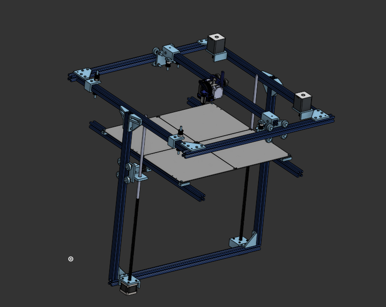

# helper-1
a cheap corexy 3d printer designed primarily for building plane wings and generally big things

## capabilities:
given the weight of the toolhead and the extrusion its supported by chatgpt did some math for me and said it should be able to do 6k acceleration so, my goal wasnt for it to be extremely fast, it was for it to be able to print large volumes, right now it can do 400mm by 400mm by 450mm for height
also, since big heated beds are absurdly expensive, i decided to make the heated bed pcbs myself,
and instead of having one big one it will have 4 200x200 ones and because I am building this with hackclub, the heated bed doesnt use the 300 usd budget we might be given to build our printers

## how to build:
once i do build this printer ill provide better instructions but for now
you can follow the Bom under the cad folder and then open up the cad on onshape or some other program
the assembly shouldnt be too complecated, i tried my best to make simple especially because I'm not very good with mechanical things.

## electronics Bom:
5x nema 17 stepper motors
1x skr mini v2
1x diy or bought at least 420w bed driver
4x the heated bed pcb 
1x pi zero 2w for cloud print or in my case an ethernet sbc (radxa 3e)
as many connectors as you need (just buy a box)
2x sd card

## notes:
you might be wondering why it doesnt just llok like a box, and the reason for that is that boxes have 12 edges, which is already a lot of aluminum extrusions and since im using 600mm 2020 extrusion it gets expensive fast

make sure that once you do get your parts mesure all the parts to ensure each 3d printed adapter / connector fits perfectly, i dont have any parts to mesure them so most is based of of measurements i found online but from what ive seen they can change from manufacturer to manufacturer and you dont want to print a kilogram of plastic only to realise it doesnt fit togheter

cad:
https://cad.onshape.com/documents/2123402270f28d911c454b7e/w/1b68320c875217382b4c33ce/e/86b8f7cdf32d57478722f015